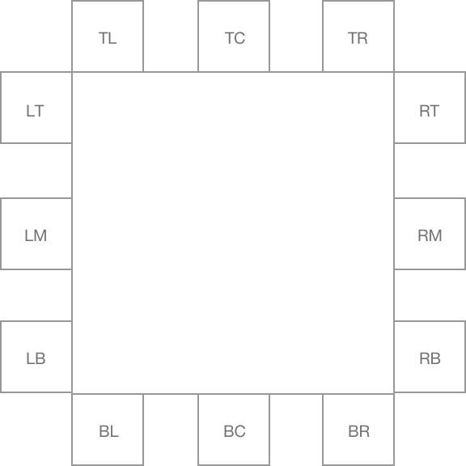

# @zestia/position-utils

Rudimentary utils for determining the position of an element within another element, and positioning
elements near other elements. These utils do the bare minimum, as further positioning can be done with CSS translate.

<hr>

#### `getPosition(element, container, columns, rows)`

Returns where `element` is considered to be positioned inside `container`, based on a bounding box created by splitting the `container` into `columns` and `rows`. Here are some examples:


#### `getCoords(position, element, reference[, container])`

Returns the coordinates required to place `element` on the outside edge of `reference`, taking into consideration the desired `position` (e.g. `top left`). If `container` is present, then the desired `position` _may_ be ignored in favour of an adjusted position that will keep `element` visible inside `container`. Here are the possible postions:



<hr />

### Examples

```javascript
const element = document.querySelector('.element');
const reference = document.querySelector('.reference');
const container = document.querySelector('.container');

// Get position of element inside container, could be in 1 of 9 possible positions
getPosition(element, container, 3, 3);

// Get position of element inside the document, could be in one of 2 possible locations: top center or bottom center
getPosition(element, document, 1, 2);

// Get position of element inside the viewport, with edge positions less likely to be considered
getPosition(element, window, 5, 5);

// Get coords to position element at the bottom left of reference
getCoords('bottom left', element, reference);

// Get coords to position element at the top left of reference. If it doesn't fit in the document, this will be adjusted
getCoords('top left', element, reference, document);

// Get coords to position element at the bottom left of reference. If it doesn't fit in the viewport, this will be adjusted
getCoords('bottom left', element, reference, window);

// Get coords to position element on the right bottom of reference. If it doesn't fit in container, this will be adjusted
getCoords('right bottom', element, reference, container);
```
