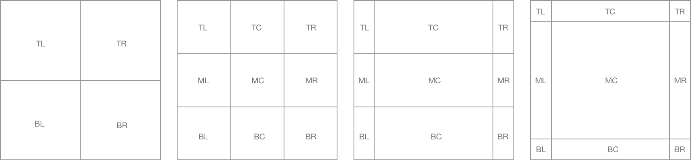
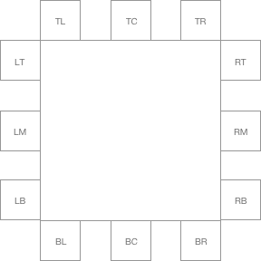

# @zestia/position-utils

Rudimentary utils for determining the position of an element within another element, and positioning
elements near other elements. These utils do the bare minimum, as further positioning can be done with CSS translate.

<hr>

##### elementPosition(element, container, columns, rows)

Returns where `element` is considered to be position inside `container`, based on a bounding box created by splitting the `container` into `columns` and `rows`.



##### positionCoords(string, element, reference)

Returns the coordinates required to place `element` on the outside edge of `reference`, taking into consideration the desired position defined by `string` (e.g. `top left`).



<hr>

### Example

```javascript
// A typical example involves 3 elements:
// 1. An element in a container
// 2. The container element
// 3. Another element, to be positioned near the first element

const element = document.querySelector('.my-element');
const container = document.documentElement;
const popup = document.querySelector('.popup');

// Find the position of element, inside container when it is split into
// a grid, creating a bounding box e.g.
// 1000 x 1000 = { top: 333, left: 333, bottom: 666, right: 666 }

const elPosition = elementPosition(element, container, 3, 3);

// In this example, based on the bounding box, element was considered
// to be in the 'top left' of container. So, it make sense to position
// our popup element beneath it...

// Compute the coordinates to position popup on the bottom left edge of element
const [left, top] = positionCoords('bottom left', popup, element);
```
